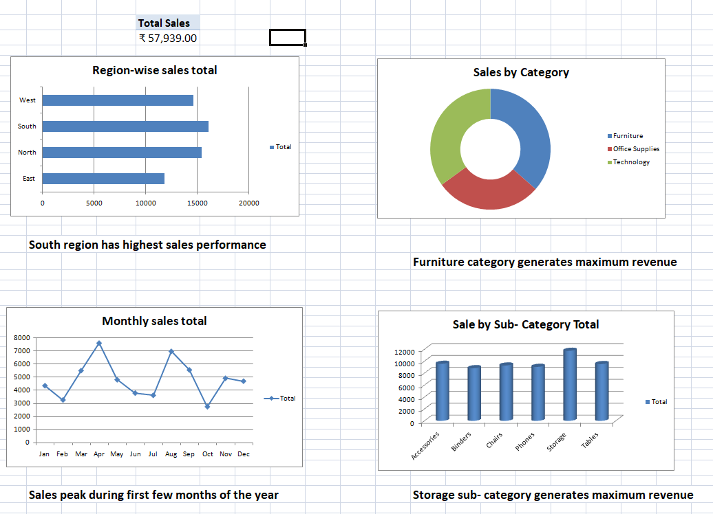

📊 Excel Sales Dashboard Project

Overview
This project is an interactive Excel Sales Dashboard built using Pivot Tables and Charts to analyze sales performance across regions, categories, and time trends.

Files in this Repository
- Excel dataset (.xlsx)
- Dashboard screenshot (PNG image)

Dashboard Preview
 Main Dashboard

Key Analysis
- Sales by Region
- Sales by Category
- Monthly Sales Trends
- Top Performing Sub-Categories

Tools Used
- Microsoft Excel
- Pivot Tables
- Charts (Bar, Pie, Line)

Key Insights
- Identified top-performing regions
- Found highest revenue-generating category
- Analyzed monthly sales trends

Outcome
This dashboard highlights sales performance across regions and product categories.
And this project demonstrates my ability to clean data, build dashboards, and extract business 
insights using Excel.
